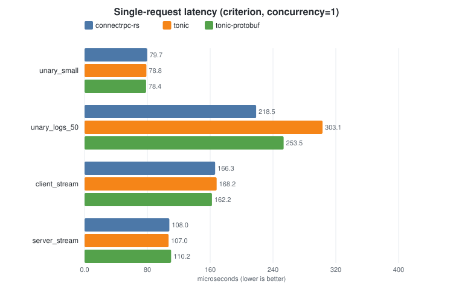
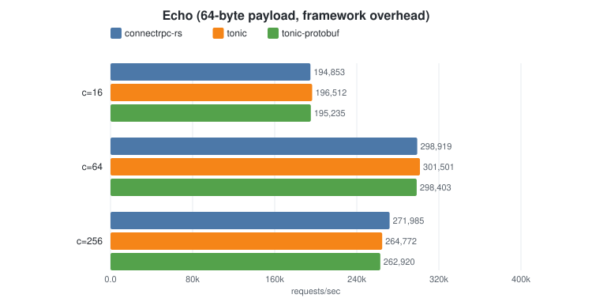
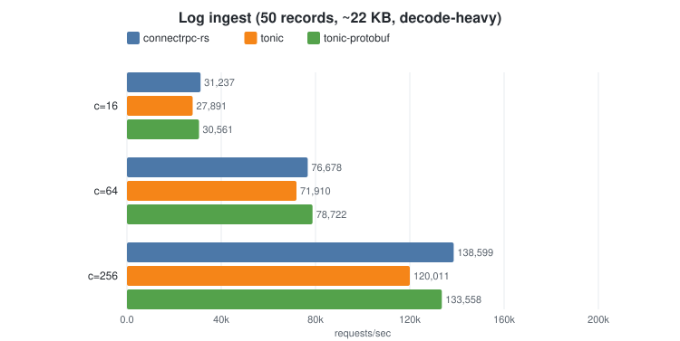

# connectrpc

[](https://crates.io/crates/connectrpc)
[](https://docs.rs/connectrpc)
[](https://github.com/connectrpc/connect-rust/actions/workflows/ci.yml)
[](Cargo.toml)
[](https://deps.rs/repo/github/connectrpc/connect-rust)
[](LICENSE)

A [Tower](https://docs.rs/tower/latest/tower/)-based Rust implementation of [ConnectRPC](https://connectrpc.com/), serving Connect, gRPC, and gRPC-Web clients over HTTP with binary or JSON protobuf messages.

**Status:** pre-1.0. The API surface is settling but may shift in 0.x. Production-quality runtime: passes the full ConnectRPC conformance suite — 3,600 server and 6,872 client tests across the three protocols.

**MSRV:** Rust 1.88 (declared on the workspace, verified in CI).

**Documentation:**

- [User guide](docs/guide.md) - long-form coverage of installation, code generation, server/client usage, streaming, tower middleware, TLS, and errors.
- [`examples/`](examples/) - runnable end-to-end examples (streaming, tower middleware, TLS, multi-service, browser/wasm, Bazel).
- [docs.rs](https://docs.rs/connectrpc) - API reference.

## Overview

connectrpc provides:

- **`connectrpc`** — A Tower-based runtime library implementing the Connect protocol
- **`protoc-gen-connect-rust`** — A `protoc` plugin that generates service traits, clients, and message types
- **`connectrpc-build`** — `build.rs` integration for generating code at build time
- **`connectrpc-health`** — The standard `grpc.health.v1.Health` service, for `grpc_health_probe` / kubelet gRPC probes / service-mesh health checks
- **`connectrpc-reflection`** — The standard gRPC server reflection service (`grpc.reflection.v1` + `v1alpha`), so `grpcurl`, `buf curl`, Postman, and `grpcui` can discover and call your services

The runtime is built on [`tower::Service`](https://docs.rs/tower/latest/tower/trait.Service.html), making it framework-agnostic. It integrates with any tower-compatible HTTP framework including [Axum](https://docs.rs/axum), [Hyper](https://docs.rs/hyper), and others.

## Quick Start

### Define your service

```protobuf
// greet.proto
syntax = "proto3";
package greet.v1;

service GreetService {
  rpc Greet(GreetRequest) returns (GreetResponse);
}

message GreetRequest {
  string name = 1;
}

message GreetResponse {
  string greeting = 1;
}
```

### Generate Rust code

Two workflows are supported. Both produce the same runtime API; pick the one
that fits your build pipeline.

#### Option A - `buf generate` (recommended for checked-in code)

Runs two codegen plugins (`protoc-gen-buffa` for message types,
`protoc-gen-connect-rust` for service stubs) and `protoc-gen-buffa-packaging`
twice to assemble the `mod.rs` module tree for each output directory. The
codegen plugins are invoked per-file; only the packaging plugin needs
`strategy: all`.

##### Installing the plugins

`protoc-gen-buffa` and `protoc-gen-buffa-packaging` ship from the
[`buffa`](https://github.com/anthropics/buffa) repo - see its release
page for binaries or `cargo install`.

For `protoc-gen-connect-rust`, three options:

**1. Download a pre-built binary from the GitHub release.** Releases
ship Linux (x86_64, aarch64), macOS (x86_64, aarch64), and Windows
(x86_64) binaries, each with a SHA-256 checksum, a Sigstore signature
(`.sig` + `.pem`), and a GitHub-native build provenance attestation.

```sh
VERSION=v0.9.0
PLATFORM=linux-x86_64        # or darwin-aarch64, etc.
BASE=https://github.com/connectrpc/connect-rust/releases/download/${VERSION}
BIN=protoc-gen-connect-rust-${VERSION}-${PLATFORM}

curl -fSL -o "${BIN}"        "${BASE}/${BIN}"
curl -fSL -o "${BIN}.sig"    "${BASE}/${BIN}.sig"
curl -fSL -o "${BIN}.pem"    "${BASE}/${BIN}.pem"
curl -fSL -o checksums-sha256.txt "${BASE}/checksums-sha256.txt"

# Verify the checksum.
grep " ${BIN}\$" checksums-sha256.txt | sha256sum -c -

# Verify the GitHub-native attestation (no .sig/.pem download needed).
gh attestation verify "${BIN}" --repo connectrpc/connect-rust

# Or verify the cosign signature directly.
cosign verify-blob \
  --certificate "${BIN}.pem" \
  --signature "${BIN}.sig" \
  --certificate-identity "https://github.com/connectrpc/connect-rust/.github/workflows/release.yml@refs/tags/${VERSION}" \
  --certificate-oidc-issuer "https://token.actions.githubusercontent.com" \
  "${BIN}"

install -m 0755 "${BIN}" /usr/local/bin/protoc-gen-connect-rust
```

**2. Build from source via cargo.** Pulls the latest published
`connectrpc-codegen` crate from crates.io and installs the binary into
`$CARGO_HOME/bin`:

```sh
cargo install --locked connectrpc-codegen
```

**3. Buf Schema Registry remote plugin.** The plugin is published on the
Buf Schema Registry as
[`buf.build/connectrpc/rust`](https://buf.build/connectrpc/rust), with
versions tracking connect-rust releases. No local install of
`protoc-gen-connect-rust` is needed: replace the
`local: protoc-gen-connect-rust` entry below with
`remote: buf.build/connectrpc/rust:v0.9.0`.

```yaml
# buf.gen.yaml
version: v2
plugins:
  - local: protoc-gen-buffa
    out: src/generated/buffa
    opt: [views=true, json=true]
  - local: protoc-gen-buffa-packaging
    out: src/generated/buffa
    strategy: all
  - local: protoc-gen-connect-rust
    out: src/generated/connect
    opt: [buffa_module=crate::proto]
  - local: protoc-gen-buffa-packaging
    out: src/generated/connect
    strategy: all
    opt: [filter=services]
```

```rust
// src/lib.rs
#[path = "generated/buffa/mod.rs"]
pub mod proto;
#[path = "generated/connect/mod.rs"]
pub mod connect;
```

`buffa_module=crate::proto` tells the service-stub generator where you
mounted the buffa output. For a method input type `greet.v1.GreetRequest`
it emits `crate::proto::greet::v1::GreetRequest` - the `crate::proto` root
you named, then the proto package as nested modules, then the type. The
second packaging invocation uses `filter=services` so the connect tree's
`mod.rs` only `include!`s files that actually have service stubs in them.
Changing the mount point requires regenerating.

> The underlying option is `extern_path=.=crate::proto` - same format the
> Buf Schema Registry uses when generating Cargo SDKs. `buffa_module=X`
> is shorthand for the `.` catch-all case. Any module an `extern_path`
> points at must be buffa-generated code from buffa 0.9.0 or newer with
> views enabled (buffa-types 0.9+ for the well-known types): the service
> stubs rely on the `HasMessageView` impls and owned-view wrappers that
> buffa generates alongside each message, just as they rely on the JSON
> serialization impls.

#### Option B - `build.rs` (generated at build time)

Unified output: message types and service stubs in one file per proto,
assembled via a single `include!`. No plugin binaries required at build time.

```toml
[build-dependencies]
connectrpc-build = "0.9"
```

```rust
// build.rs
fn main() {
    connectrpc_build::Config::new()
        .files(&["proto/greet.proto"])
        .includes(&["proto/"])
        .include_file("_connectrpc.rs")
        .compile()
        .unwrap();
}
```

```rust
// lib.rs
pub mod proto {
    connectrpc::include_generated!();
}
```

### Implement the server

```rust
use connectrpc::{RequestContext, Response, ServiceRequest, ServiceResult};

struct MyGreetService;

impl GreetService for MyGreetService {
    async fn greet(
        &self,
        _ctx: RequestContext,
        request: ServiceRequest<'_, GreetRequest>,
    ) -> ServiceResult<GreetResponse> {
        // `request` derefs to the view — string fields are borrowed `&str`
        // directly from the request buffer (zero-copy). The borrow lives for
        // the duration of the call; use `request.to_owned_message()` for
        // anything that must outlive it (e.g. `tokio::spawn`).
        Response::ok(GreetResponse {
            greeting: format!("Hello, {}!", request.name),
            ..Default::default()
        })
    }
}
```

### With Axum (recommended)

```rust
use axum::{Router, routing::get};
use connectrpc::Router as ConnectRouter;
use std::sync::Arc;

let connect = ConnectRouter::new().add_service(Arc::new(MyGreetService));

// Plain HTTP liveness probe for `kubectl`'s httpGet style. For the
// standard gRPC Health protocol (grpc_health_probe, kubelet `grpc:`
// probes), mount `connectrpc_health::HealthService` on the Connect
// router instead — see docs/guide.md#health-checking.
let app = Router::new()
    .route("/health", get(|| async { "OK" }))
    .fallback_service(connect.into_axum_service());

let listener = tokio::net::TcpListener::bind("0.0.0.0:8080").await?;
axum::serve(listener, app).await?;
```

### Standalone server

For simple cases, enable the `server` feature for a built-in hyper server:

```rust
use connectrpc::{Router, Server};
use std::sync::Arc;

let router = Router::new().add_service(Arc::new(MyGreetService));

Server::new(router).serve("127.0.0.1:8080".parse()?).await?;
```

### Client

Enable the `client` feature for HTTP client support with connection pooling:

```rust
use connectrpc::client::{HttpClient, ClientConfig};

let http = HttpClient::plaintext();  // cleartext http:// only; use with_tls() for https://
let config = ClientConfig::new("http://localhost:8080".parse()?);
let client = GreetServiceClient::new(http, config);

let response = client.greet(GreetRequest {
    name: "World".into(),
}).await?;
```

### Per-call options and client-wide defaults

Generated clients expose both a no-options convenience method and a
`_with_options` variant for per-call control (timeout, headers, max
message size, compression override):

```rust
use connectrpc::client::CallOptions;
use std::time::Duration;

// Per-call timeout
let response = client.greet_with_options(
    GreetRequest { name: "World".into() },
    CallOptions::default().with_timeout(Duration::from_secs(5)),
).await?;
```

For options you want on *every* call (e.g. auth headers, a default
timeout), set them on `ClientConfig` instead — the no-options method
picks them up automatically:

```rust
let config = ClientConfig::new("http://localhost:8080".parse()?)
    .with_default_timeout(Duration::from_secs(30))
    .with_default_header("authorization", "Bearer ...");

let client = GreetServiceClient::new(http, config);

// Uses the 30s timeout and auth header without repeating them:
let response = client.greet(request).await?;
```

Per-call `CallOptions` override config defaults (options win).

### Streaming, interceptors, middleware, TLS

The Quick Start above shows the unary path. For everything else, see the user guide and the focused examples:

- **Streaming RPCs** (server, client, bidi) - see [docs/guide.md#streaming-rpcs](docs/guide.md#streaming-rpcs) and [`examples/streaming-tour/`](examples/streaming-tour) for all four RPC types side-by-side.
- **Interceptors** (typed, async per-RPC middleware for unary and streaming calls) - see [docs/guide.md#interceptors](docs/guide.md#interceptors). Interceptors see the resolved `Spec`, headers, deadline, and a lazily decoded message body, and can rewrite or short-circuit the call - the equivalent of `connect-go`'s `WithInterceptors`.
- **Tower middleware on the server** (gzip, raw header rewriting, generic HTTP concerns below the RPC layer) - see [docs/guide.md#tower-middleware](docs/guide.md#tower-middleware) and [`examples/middleware/`](examples/middleware) for a custom auth layer that stamps caller identity into request extensions.
- **TLS / mTLS** - see [docs/guide.md#tls](docs/guide.md#tls) and [`examples/eliza/README.md`](examples/eliza/README.md) for cert generation and `Server::with_tls` / `HttpClient::with_tls` patterns.
- **gRPC health checking** (`grpc.health.v1.Health`, used by `grpc_health_probe`, kubelet `grpc:` probes, and service meshes) - see [docs/guide.md#health-checking](docs/guide.md#health-checking) and the [`connectrpc-health`](connectrpc-health/) crate.
- **gRPC server reflection** (`grpc.reflection.v1` + `v1alpha`, used by `grpcurl`, `buf curl`, Postman, and `grpcui`) - see the [`connectrpc-reflection`](connectrpc-reflection/) crate, and run [`examples/multiservice/reflection-demo.sh`](examples/multiservice/reflection-demo.sh) for a `buf curl` walkthrough against a live server.

## Feature Flags

| Feature      | Default | Description                                      |
| ------------ | ------- | ------------------------------------------------ |
| `json`       | Yes     | JSON codec for protobuf messages. Disable (with codegen `no_json`) for proto-only builds — see [Proto-only builds](#proto-only-no-json-builds) |
| `gzip`       | Yes     | Gzip compression via flate2                      |
| `zstd`       | Yes     | Zstandard compression via zstd                   |
| `client`     | No      | HTTP client transports (plaintext)               |
| `client-tls` | No      | TLS for client transports (`HttpClient::with_tls`, `Http2Connection::connect_tls`) |
| `server`     | No      | Standalone hyper-based server                    |
| `server-tls` | No      | TLS for the built-in server (`Server::with_tls`) |
| `tls`        | No      | Convenience: enables both `server-tls` + `client-tls` |
| `axum`       | No      | Axum framework integration                       |

### wasm32

The core crate compiles for `wasm32-unknown-unknown`. Generated clients are generic over `ClientTransport`, so they work on wasm with a custom transport (e.g. `web-sys::fetch`). The `client`/`server`/`tls` features require platform networking and `zstd` requires native C compilation. See [`examples/wasm-client`](examples/wasm-client) for a complete Fetch-based transport.

```toml
[dependencies]
connectrpc = { version = "0.9", default-features = false, features = ["gzip"] }
```

### Minimal build (no compression)

```toml
[dependencies]
connectrpc = { version = "0.9", default-features = false }
```

### Proto-only (no-JSON) builds

A deployment that only speaks binary proto can drop the JSON codec and the
`serde` derives it requires on message types. Generate code with the `no_json`
plugin option (or `connectrpc-build`'s `.generate_json(false)`) so message
structs are emitted without serde derives, and disable the runtime `json`
feature:

```toml
[dependencies]
# Note: `default-features = false` is the only way to drop `json`, so it also
# drops the default compression features — re-list any you still want.
connectrpc = { version = "0.9", default-features = false, features = ["server", "gzip", "zstd"] }
```

With `json` off, message-type bounds relax from `Message + Serialize` to just
`Message`, so serde-free generated code compiles. A JSON request to such a
server is declined at content negotiation with HTTP 415 Unsupported Media Type
(for gRPC / gRPC-Web, a gRPC error status); the JSON codec selectors on the
client (`ClientConfig::json`) are removed from the API too. See the [user guide](docs/guide.md#proto-only-no-json-builds) for
details.

> **Cargo feature unification:** `json` is an additive, default-on feature, so
> it is only truly off when *every* crate in your dependency graph that pulls in
> `connectrpc` disables it. If any other crate depends on `connectrpc` with
> `json` on, unification turns it back on for the whole build and your
> serde-free generated types will fail to compile (`Serialize is not
> satisfied`). Proto-only mode therefore fits leaf binaries and fully
> proto-only graphs, not a single library in a mixed workspace.

### With Axum integration

```toml
[dependencies]
connectrpc = { version = "0.9", features = ["axum"] }
```

## Generated Code Dependencies

Code generated by `protoc-gen-connect-rust` requires these dependencies:

```toml
[dependencies]
connectrpc = { version = "0.9", features = ["client"] }
buffa = { version = "0.9", features = ["json"] }
buffa-types = { version = "0.9", features = ["json"] }
serde = { version = "1", features = ["derive"] }
serde_json = "1"
```

(`http-body`, whose `Body` trait appears in generated client bounds, is
re-exported by `connectrpc` — no direct dependency needed.)

For **proto-only** code (generated with `no_json`, and `connectrpc` built with
`default-features = false`), drop the `json` feature on `buffa`/`buffa-types`
and omit `serde`/`serde_json` — the generated message types no longer derive
them. See [Proto-only builds](#proto-only-no-json-builds).

### Optional: gate the client behind a Cargo feature

If you want a server-only build of your crate to drop the
`connectrpc/client` transport stack, opt in to the cfg gate. With
`buf generate`:

```yaml
# buf.gen.yaml
plugins:
  - local: protoc-gen-connect-rust
    out: src/gen/connect
    opt: [buffa_module=crate::proto, gate_client_feature]
```

Or with `connectrpc-build` in `build.rs`:

```rust
// build.rs
connectrpc_build::Config::new()
    .files(&["proto/greet.proto"])
    .includes(&["proto/"])
    .gate_client_feature(true)
    .compile()?;
```

The codegen then prefixes every emitted `FooClient<T>` struct and its
`impl` block with `#[cfg(feature = "client")]`. Declare the feature in
your `Cargo.toml` to forward it through to the runtime dep:

```toml
[features]
default = ["client"]
client = ["connectrpc/client"]

[dependencies]
connectrpc = { version = "0.9", features = ["server"] }  # no "client"
```

`cargo build --no-default-features` now leaves out the `FooClient` items
*and* drops `connectrpc/client` (the HTTP/2 transport stack) from the
dependency graph. See `connectrpc-health` for the minimal example. The
option is opt-in; the default emission is unconditional.

## Protocol Support

| Protocol | Status |
|---|---|
| Connect (unary + streaming) | ✓ |
| gRPC over HTTP/2 | ✓ |
| gRPC-Web | ✓ |

All 3,600 ConnectRPC server conformance tests and 6,872 client conformance
tests pass across all three protocols (2,580 Connect, 1,454 gRPC,
2,838 gRPC-Web). Run the server suite with `task conformance:test` and the
client suites with `task conformance:test-client-*`.

| RPC type | Status |
|---|---|
| Unary | ✓ (POST + GET for idempotent methods) |
| Server streaming | ✓ |
| Client streaming | ✓ |
| Bidirectional streaming | ✓ |

The gRPC server reflection service (`grpc.reflection.v1` and `v1alpha`)
is provided by the [`connectrpc-reflection`](connectrpc-reflection/)
crate, fed by `connectrpc_build::Config::emit_descriptor_set` (which
writes the `FileDescriptorSet` with its full import closure to `OUT_DIR`
for `include_bytes!`) or by an existing `buffa_descriptor::DescriptorPool`.

## Performance

Comparison against [tonic](https://docs.rs/tonic/) 0.14.6, the standard Rust
gRPC implementation built on the same hyper/h2 stack, in two configurations:
`tonic` is tonic with prost, and `tonic-protobuf` is tonic with
[grpc-rust](https://github.com/grpc/grpc-rust)'s codec over Google's
`protobuf` v4 runtime on the upb kernel. The `tonic` arm builds tonic from
crates.io and the `tonic-protobuf` arm from grpc-rust revision `7053afcd`, so
the two also differ by the handful of unreleased tonic commits at that
revision. connectrpc-rs uses [buffa](https://github.com/anthropics/buffa). Measured
2026-09 on a bare-metal AWS c7i.metal-24xl (Intel Xeon Platinum 8488C, turbo
disabled), client and servers on the same host over loopback. Higher is
better unless noted.

grpc-rust's own `grpc` crate is a client channel with no server, so it does
not appear in the server tables; `task bench:clients` compares it against the
connectrpc-rs and tonic clients instead. The `tonic-protobuf` arm's first build compiles `protoc` and a
protoc plugin from C++ source, so it needs cmake and a C++17 compiler; see
[`benches/rpc-grpc-rust/README.md`](benches/rpc-grpc-rust/README.md).

The short version: on small unary calls, echo throughput and server streaming
the three Rust stacks are within 3% of each other, and connectrpc-rs is 9–14%
slower than either tonic configuration on a 10-message client stream, which is
a framework cost (the server hands each streamed request message across tasks
on its way to the handler). The proto library accounts for the rest: a
50-record log-batch request completes 40% faster with buffa's zero-copy views
than with prost and 17% faster than with upb at concurrency 1, which under
load becomes 13% more throughput than prost and level with upb (−3% to +3%
across concurrency levels); and upb's arena copies make the 1 MB gzip'd
payload 13% slower.

### Single-request latency

Criterion benchmarks at concurrency=1 (no h2 contention), measuring per-request
framework + proto work in isolation. Every arm is driven by the same
connectrpc-rs client, so the columns compare servers. Lower is better.



<details><summary>Raw data (μs, lower is better)</summary>

| Benchmark | connectrpc-rs | tonic | tonic-protobuf |
|---|---:|---:|---:|
| unary_small (1 int32 + nested msg) | 79.6 | 79.7 | 78.4 (−2%) |
| unary_logs_50 (50 log records, ~22 KB) | 211.8 | 297.5 (+40%) | 247.3 (+17%) |
| unary_large (~1 MB payload, gzip request) | 2,925 | 2,847 (−3%) | 3,305 (+13%) |
| client_stream (10 messages) | 186.4 | 170.4 (−9%) | 160.6 (−14%) |
| server_stream (10 messages) | 107.5 | 106.1 (−1%) | 110.5 (+3%) |

The same bench also runs [connect-go](https://github.com/connectrpc/connect-go)
over gRPC: 249 μs unary_small, 527 μs unary_logs_50, 406 μs client_stream,
1,083 μs server_stream. Over the Connect protocol, unary_small is 80.6 μs on
connectrpc-rs and 142 μs on connect-go.

Run with `task bench:cross`.

</details>

### Echo throughput

64-byte string echo, 8 h2 connections (to avoid single-connection mutex
contention — see [h2 #531](https://github.com/hyperium/h2/issues/531)).
Measures framework dispatch + envelope framing + proto encode/decode with
minimal handler work; all three stacks land within 2% of each other.



<details><summary>Raw data (req/s)</summary>

| Concurrency | connectrpc-rs | tonic | tonic-protobuf |
|---|---:|---:|---:|
| c=16 | 189,624 | 193,164 (+2%) | 191,938 (+1%) |
| c=64 | 299,826 | 301,387 (+1%) | 299,864 |
| c=256 | 270,927 | 266,473 (−2%) | 267,400 (−1%) |

A second pass in the same session reproduced every cell within 1%.

Run with `task bench:echo -- --multi-conn=8`.

</details>

### Client stacks

The tables above hold the client fixed and vary the server; this one holds the
server fixed (the connectrpc-rs echo server) and varies the client: the
generated connectrpc-rs client over `HttpClient` (hyper-util's pooled client)
and over `SharedHttp2Connection` (one raw h2 connection), tonic's generated
client, and grpc-rust's `grpc` channel with its `protobuf` codec. Closed loop,
64-byte echo, each cell the median of three 10-second runs.

<details><summary>Raw data (req/s)</summary>

| Connections × concurrency | connectrpc-rs `HttpClient` | connectrpc-rs `SharedHttp2Connection` | tonic | grpc-rust |
|---|---:|---:|---:|---:|
| 1 × 1 | 17,343 | 17,176 (−1%) | 17,273 | 15,133 (−13%) |
| 1 × 16 | 36,372 | 36,287 | 35,277 (−3%) | 37,139 (+2%) |
| 1 × 64 | 41,145 | 40,546 (−1%) | 35,934 (−13%) | 36,898 (−10%) |
| 8 × 1 | 17,262 | 17,217 | 17,177 | 15,049 (−13%) |
| 8 × 16 | 191,527 | 189,871 (−1%) | 191,933 | 181,187 (−5%) |
| 8 × 64 | 300,751 | 297,133 (−1%) | 298,744 (−1%) | 292,344 (−3%) |

At one request at a time the three hyper-based clients take 57–58 μs per call
(p50) and grpc-rust's channel 65 μs. With 64 requests in flight on a single
connection the two connectrpc-rs transports keep scaling to 41k req/s where
tonic and grpc-rust level off at 36–37k; spread over 8 connections all four
are within 5%.

Run with `task bench:clients`.

</details>

### Log ingest (decode-heavy)

50 structured log records per request (~22 KB batch): varints, string fields,
nested message, map entries. Handler iterates every field to force full decode.
This is where the proto library matters: buffa's views borrow string data from
the request buffer, prost allocates a `String` per field and a `HashMap` per
map, and upb parses eagerly into a per-message arena, copying string bytes but
avoiding per-field heap allocations — which puts it much closer to buffa than
to prost.



<details><summary>Raw data (req/s)</summary>

| Concurrency | connectrpc-rs | tonic | tonic-protobuf |
|---|---:|---:|---:|
| c=16 | 30,660 | 27,488 (−10%) | 30,246 (−1%) |
| c=64 | 75,166 | 71,887 (−4%) | 77,588 (+3%) |
| c=256 | 134,741 | 119,628 (−11%) | 131,365 (−3%) |

At c=256, connectrpc-rs decodes **6.7M records/sec**, tonic-protobuf 6.6M and
tonic 6.0M. A second pass in the same session reproduced every cell within
1%.

**Raw mode (`strict_utf8_mapping`):** For trusted-source log ingestion where
UTF-8 validation is unnecessary, buffa can emit `&[u8]` instead of `&str` for
string fields (editions `utf8_validation = NONE` + the `strict_utf8_mapping`
codegen option). The 2026-03 CPU profile below shows this eliminates the
11–12% of server CPU spent in `str::from_utf8`. End-to-end throughput gain in this benchmark
is small (136.5k vs 134.7k req/s at c=256) because client encode
becomes the bottleneck when both run on one machine — in production with
separate client/server, the server sees the CPU saving as capacity.

Run with `task bench:log`.

</details>

### Fortunes (realistic workload + backing store)

Handler performs a network round-trip to a [valkey](https://valkey.io/)
container (`HGETALL` of 12 fortune messages, ~800 bytes), adds an ephemeral
record, sorts, and encodes a 13-message response. This is the shape of a
typical read-mostly service: RPC framing + async I/O wait + moderate-size
response. Every server uses an 8-connection valkey pool; client uses
8 h2 connections so protocol framing is the only variable.

<details><summary>Raw data (req/s, c=256)</summary>

**Cross-implementation (gRPC protocol):**

| Implementation | req/s | vs connectrpc-rs |
|---|---:|---:|
| connectrpc-rs | 199,574 | — |
| tonic | 192,127 | −4% |
| connect-go | 88,054 | −56% |

**Protocol framing (connectrpc-rs server):**

| Protocol | c=16 | c=64 | c=256 | Connect ÷ gRPC |
|---|---:|---:|---:|---:|
| Connect | 73,511 | 177,700 | 245,173 | **1.23×** |
| gRPC | 69,706 | 157,481 | 199,574 | — |
| gRPC-Web | 69,067 | 153,727 | 191,811 | — |

Connect's ~20% unary throughput advantage over gRPC at c=256 comes from
simpler framing: no envelope header, no trailing HEADERS frame. At 200k+
req/s, gRPC's trailer frame is ~200k extra h2 HEADERS encodes per second.
The gap grows with throughput (5% @ c=16 → 23% @ c=256).

Run with `task bench:fortunes:protocols:h2`. Requires `docker` for the
valkey sibling container (image pulled automatically on first run). These
fortunes figures are from the 2026-03 run and predate the `tonic-protobuf`
arm.

</details>

### Where the log-ingest difference comes from

CPU profile breakdown (log-ingest, c=64, 30s, `task profile:log`, 2026-03
run against tonic + prost):

| Cost center | connectrpc-rs | tonic |
|---|---:|---:|
| Proto decode (views/owned) | 14.7% | 2.1% |
| UTF-8 validation | 11.2% | 4.0% |
| Varint decode | 2.2% | 3.5% |
| String alloc + copy | ~0 | **6.2%** |
| HashMap ops (map fields) | ~0 | **8.5%** |
| **Total proto** | **27.1%** | **~24%** (+allocator) |
| Allocator (malloc/free/realloc) | **3.6%** | **9.6%** |

The difference is allocation: 3.6% of CPU in the allocator against 9.6%, and
nothing in `HashMap` operations against 8.5%. buffa's view types borrow
string data directly from the request buffer (zero allocs per string field);
`MapView` is a flat `Vec<(K,V)>` scan with no hashing. tonic/prost must fully
materialize `String` + `HashMap<String,String>` for every record before the
handler runs. upb sits between the two: it copies string bytes into a
per-message arena but makes no per-field heap allocation, which is consistent
with it landing within a few percent of buffa in the tables above.

The framework layer itself — codegen-emitted `FooServiceServer<T>` with
compile-time `match` dispatch, a two-frame `GrpcUnaryBody` for the common unary
case, and stream-message batching into fewer h2 DATA frames — measures level
with tonic's on the echo and small-unary benches above, so the decode path is
where the difference is made.

## Custom Compression

The compression system is pluggable:

```rust
use connectrpc::{CompressionProvider, CompressionRegistry, ConnectError};
use bytes::Bytes;

struct MyCompression;

impl CompressionProvider for MyCompression {
    fn name(&self) -> &'static str { "my-algo" }
    fn compress(&self, data: &[u8]) -> Result<Bytes, ConnectError> { /* ... */ }
    fn decompressor<'a>(&self, data: &'a [u8]) -> Result<Box<dyn std::io::Read + 'a>, ConnectError> {
        // Return a reader that yields decompressed bytes. The framework
        // controls how much is read, so decompress_with_limit is safe by default.
        /* ... */
    }
}

let registry = CompressionRegistry::default().register(MyCompression);
```

## Protocol Specifications

This implementation tracks the following upstream specifications:

- [Connect Protocol](https://connectrpc.com/docs/protocol/)
- [gRPC over HTTP/2](https://github.com/grpc/grpc/blob/master/doc/PROTOCOL-HTTP2.md)
- [gRPC-Web](https://github.com/grpc/grpc/blob/master/doc/PROTOCOL-WEB.md)

Local copies can be fetched with `task specs:fetch` (see [`docs/specs/`](docs/specs/)).

## Contributing

See [CONTRIBUTING.md](CONTRIBUTING.md). All commits must be signed off to
affirm the [Developer Certificate of Origin](https://developercertificate.org/)
(`git commit -s`); no Contributor License Agreement is required. The current
maintainers are listed in [MAINTAINERS.md](MAINTAINERS.md).

## License

This project is licensed under the [Apache License, Version 2.0](LICENSE).
